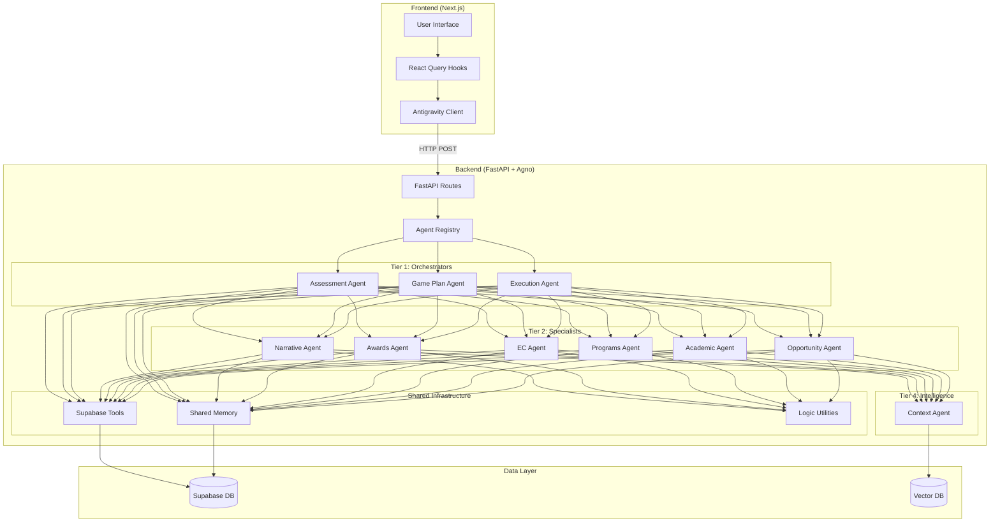
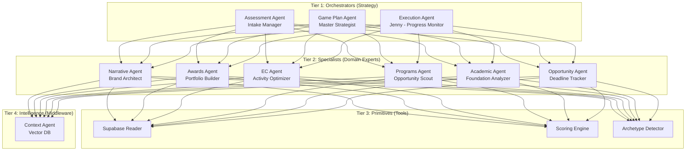
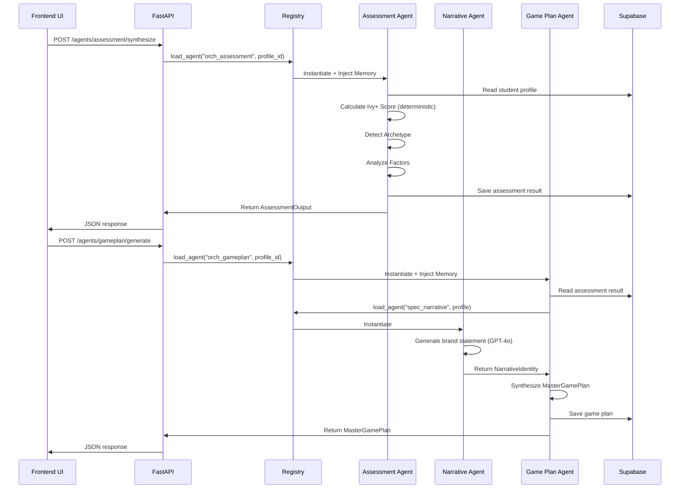
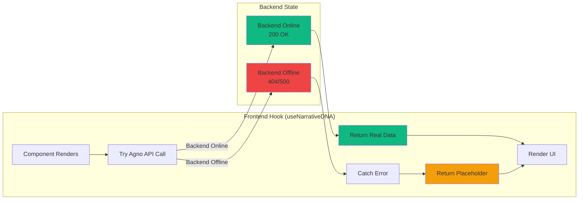
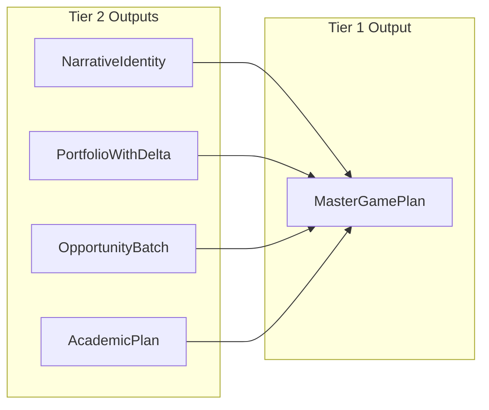
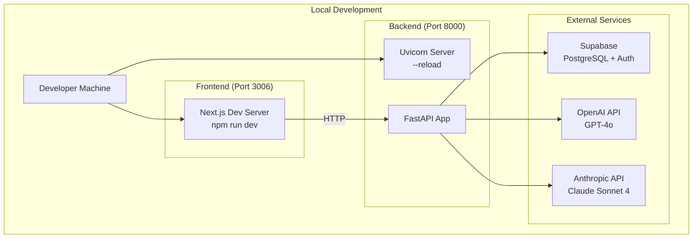
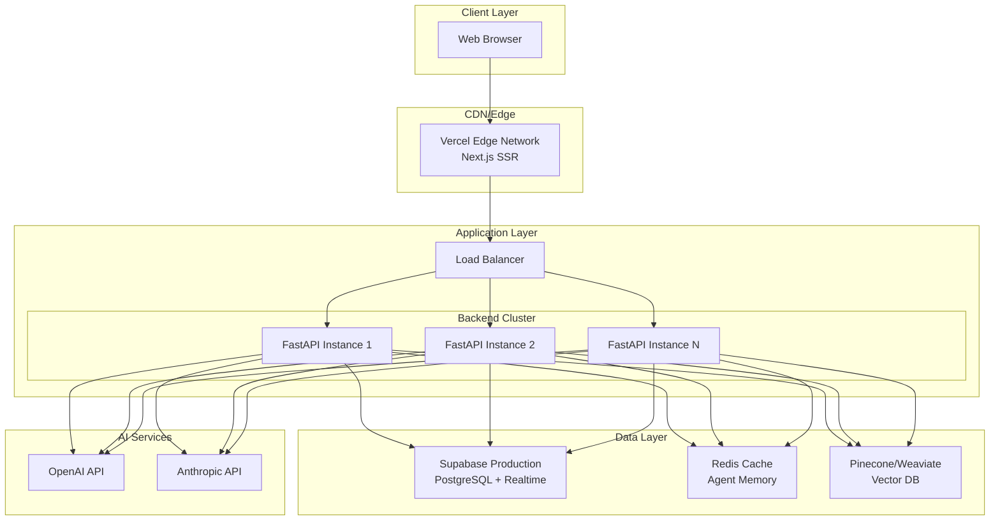

# IvyLevel v3.0 - Agno Multi-Agent System
## Complete Technical Specification

**Version**: 3.0.0  
**Date**: 2026-01-29  
**Architecture**: Plug-and-Play Multi-Agent with Antigravity Frontend

---

## Table of Contents

1. [System Overview](#system-overview)
2. [Architecture Diagrams](#architecture-diagrams)
3. [Agent Hierarchy](#agent-hierarchy)
4. [Data Flow](#data-flow)
5. [Backend Implementation](#backend-implementation)
6. [Frontend Implementation](#frontend-implementation)
7. [API Contracts](#api-contracts)
8. [File Structure](#file-structure)
9. [Deployment Architecture](#deployment-architecture)
10. [Agent Catalog](#agent-catalog)

---

## 1. System Overview

### Vision

IvyLevel v3.0 is a **multi-agent coaching system** that helps students build elite college applications through AI-powered strategic planning. The system uses **6 specialist agents** working in parallel, coordinated by **3 orchestrator agents**, all built on the **Agno framework**.

### Core Principles

1. **Plug-and-Play Architecture**: Add new agents by adding ONE line to registry
2. **Federation Pattern**: Agents communicate via Pydantic schemas
3. **Antigravity Frontend**: UI works even when backend is offline
4. **Type Safety**: All data contracts enforced via Pydantic
5. **Shared Memory**: All agents access unified student context (Hippocampus)
6. **Deterministic Scoring**: The Mirror Law - scores are calculated, never hallucinated

### Technology Stack

**Backend**:
- **Framework**: FastAPI (Python 3.13)
- **Agent Framework**: Agno (multi-agent orchestration)
- **LLMs**: Claude Sonnet 4, GPT-4o
- **Database**: Supabase (PostgreSQL)
- **Memory**: Agno Memory System (conversation history)

**Frontend**:
- **Framework**: Next.js 14.2.14 (React 18)
- **State Management**: React Query (TanStack Query v5)
- **Styling**: Tailwind CSS
- **API Client**: Custom Antigravity layer

---

## 2. Architecture Diagrams

### 2.1 System Architecture (High-Level)



### 2.2 Agent Tier Hierarchy



### 2.3 Data Flow (Assessment → Game Plan)



### 2.4 Antigravity Pattern (Frontend Resilience)



---

## 3. Agent Hierarchy

### 3.1 Tier Classification

| Tier | Name | Role | Count | Examples |
|------|------|------|-------|----------|
| **1** | Orchestrators | Strategy & Coordination | 3 | Assessment, Game Plan, Execution |
| **2** | Specialists | Domain Execution | 6 | Narrative, Awards, EC, Programs, Academic, Opportunity |
| **3** | Primitives | Tools & Utilities | N/A | Supabase Reader, Scoring Engine |
| **4** | Intelligence | Middleware & Context | 1 | Context Agent (Vector DB) |

### 3.2 Agent Registry Map

**File**: `backend/agents/registry.py`

```python
AGENT_MAP: Dict[str, str] = {
    # TIER 1: ORCHESTRATORS
    "orch_assessment": "backend.agents.orchestrators.assessment.AssessmentAgent",
    "orch_gameplan": "backend.agents.orchestrators.gameplan.GamePlanAgent",
    "orch_execution": "backend.agents.orchestrators.execution.ExecutionAgent",
    
    # TIER 2: SPECIALISTS
    "spec_awards": "backend.agents.specialists.awards.AwardsAgent",
    "spec_ec": "backend.agents.specialists.ec.ECAgent",
    "spec_programs": "backend.agents.specialists.programs.ProgramsAgent",
    "spec_narrative": "backend.agents.specialists.narrative.NarrativeAgent",
    "spec_academic": "backend.agents.specialists.academic.AcademicAgent",
    "spec_opportunity": "backend.agents.specialists.opportunity.OpportunityAgent",
    
    # TIER 4: INTELLIGENCE
    "intel_context": "backend.agents.intelligence.context.ContextAgent",
}
```

### 3.3 Base Agent Protocol

All agents inherit from `IvyAgent` base class:

**File**: `backend/agents/base.py`

```python
class IvyAgent(ABC):
    """Base protocol for all IvyLevel agents"""
    
    @property
    @abstractmethod
    def agent_id(self) -> str:
        """Unique registry ID (e.g., 'orch_assessment')"""
        pass
    
    @property
    @abstractmethod
    def tier(self) -> int:
        """1=Orchestrator, 2=Specialist, 3=Primitive, 4=Intelligence"""
        pass
    
    @abstractmethod
    def get_instructions(self) -> List[str]:
        """Dynamic instructions from Vector DB"""
        pass
    
    def get_tools(self) -> List:
        """Tools available to agent (default: SupabaseReader)"""
        return [SupabaseReader()]
    
    def get_model(self) -> Claude:
        """LLM model (default: Claude Sonnet 4)"""
        return Claude(id="claude-sonnet-4-20250514")
    
    def build(self) -> Agent:
        """Build Agno Agent with memory injection"""
        memory_config = get_agent_memory(self.student_id)
        return Agent(
            name=f"{self.agent_id}_{self.student_id}",
            model=self.get_model(),
            instructions=self.get_instructions(),
            tools=self.get_tools(),
            **memory_config,
            structured_outputs=True
        )
```

---

## 4. Data Flow

### 4.1 Federation Pattern

Agents communicate via **Pydantic schemas** (data contracts):



**Key Schemas**:

1. **NarrativeIdentity** (from Narrative Agent)
   - `brand_statement`: One-sentence personal brand
   - `themes`: 3-5 key narrative themes
   - `identity_seeds`: 3 essay opening hooks
   - `archetype_alignment`: How narrative connects to archetype

2. **PortfolioWithDelta** (from Awards/EC/Programs Agents)
   - `core_recommendations`: Primary recommendations (max 5)
   - `stem_heavy_swap`: STEM alternate for MIT/Caltech (1-Swap Rule)
   - `swap_rationale`: When to use the swap

3. **MasterGamePlan** (from Game Plan Agent)
   - `narrative_brand`: Student's brand statement
   - `target_activity_list`: Dream 10 Common App slots
   - `school_strategies`: School-specific variations
   - `phases`: Roadmap timeline
   - `identity_seeds`: When to plant narrative threads

### 4.2 Request/Response Flow

**Frontend → Backend**:

```typescript
// Frontend Request
const response = await agnoApi.synthesizeNarrative(profileId);

// Translates to HTTP POST
POST http://localhost:8000/agents/assessment/synthesize
Content-Type: application/json

{
  "profile_id": "4c4c94f9-a7df-4483-9dc6-7905dda36386"
}
```

**Backend → Frontend**:

```json
{
  "status": "success",
  "data": {
    "narrative_dna": "Determined Strategist",
    "themes": ["Resilience", "Innovation", "Leadership"],
    "confidence_score": 0.85,
    "reasoning": "Based on comprehensive profile analysis",
    "markers": ["stem", "leadership"]
  }
}
```

---

## 5. Backend Implementation

### 5.1 Directory Structure

```
backend/
├── agents/
│   ├── __init__.py
│   ├── base.py                 # IvyAgent base class
│   ├── registry.py             # Agent registry (AGENT_MAP)
│   ├── schemas.py              # Pydantic data contracts (33 models)
│   │
│   ├── orchestrators/          # Tier 1
│   │   ├── assessment.py       # AssessmentAgent
│   │   ├── gameplan.py         # GamePlanAgent
│   │   └── execution.py        # ExecutionAgent (Jenny)
│   │
│   ├── specialists/            # Tier 2
│   │   ├── narrative.py        # NarrativeAgent
│   │   ├── awards.py           # AwardsAgent
│   │   ├── ec.py               # ECAgent
│   │   ├── programs.py         # ProgramsAgent
│   │   ├── academic.py         # AcademicAgent
│   │   └── opportunity.py      # OpportunityAgent
│   │
│   ├── primitives/             # Tier 3
│   │   └── __init__.py
│   │
│   ├── intelligence/           # Tier 4
│   │   └── context.py          # ContextAgent (Vector DB)
│   │
│   └── logic/                  # Shared utilities
│       ├── scout_math.py       # Ivy+ scoring formulas
│       ├── ec_math.py          # EC impact calculations
│       ├── academic_math.py    # Rigor index
│       ├── awards_math.py      # Award matching
│       ├── opportunity_math.py # Opportunity fit scoring
│       ├── execution_utils.py  # Debt score calculations
│       └── gameplan_utils.py   # Game plan synthesis
│
├── tools/
│   ├── supabase_tools.py       # Supabase CRUD operations
│   └── scoring/
│       ├── engine.py           # IvyScoreEngine
│       ├── archetypes.py       # Archetype detection
│       └── factors.py          # Helping/holding factors
│
├── api/
│   └── routes.py               # (Future) API route definitions
│
├── database/
│   └── schema.sql              # Database schema
│
├── memory.py                   # Shared memory (Hippocampus)
├── config.py                   # Environment configuration
├── main.py                     # FastAPI application entry point
└── requirements.txt            # Python dependencies
```

### 5.2 Core Components

#### 5.2.1 Agent Registry

**Purpose**: Central switchboard for agent instantiation

**The Scalability Law**: To add a new agent, add ONE line to `AGENT_MAP`

```python
# backend/agents/registry.py

def load_agent(agent_key: str, student_id: str) -> Agent:
    """
    Factory that hydrates any agent based on its Registry Key.
    
    This is the ONLY way to instantiate agents in the system.
    """
    ivy_agent = load_ivy_agent(agent_key, student_id)
    return ivy_agent.build()

def load_ivy_agent(agent_key: str, student_id_or_profile):
    """
    Factory that returns the IvyAgent instance (before build).
    Use this when you need direct access to agent methods.
    """
    if agent_key not in AGENT_MAP:
        raise ValueError(f"Agent '{agent_key}' not registered")
    
    path_str = AGENT_MAP[agent_key]
    module_path, class_name = path_str.rsplit('.', 1)
    
    module = importlib.import_module(module_path)
    agent_class = getattr(module, class_name)
    
    return agent_class(student_id_or_profile)
```

#### 5.2.2 Shared Memory (Hippocampus)

**Purpose**: All agents access unified conversation history

```python
# backend/memory.py

def get_agent_memory(student_id: str) -> Dict[str, Any]:
    """
    Get memory configuration for an agent.
    All agents share the same memory store per student.
    """
    return {
        "memory": {
            "db": "supabase",
            "table": "agent_memory",
            "user_id": student_id,
        },
        "add_history_to_messages": True,
        "num_history_responses": 5,
    }
```

#### 5.2.3 Pydantic Schemas

**File**: `backend/agents/schemas.py` (333 lines, 33 models)

**Key Schemas**:

```python
# Tier 2 Specialist Outputs
class NarrativeIdentity(BaseModel):
    brand_statement: str
    themes: List[str] = Field(min_items=3, max_items=5)
    identity_seeds: List[str] = Field(min_items=3, max_items=3)
    archetype_alignment: str

class PortfolioWithDelta(BaseModel):
    core_recommendations: List[RecommendationItem] = Field(max_items=5)
    stem_heavy_swap: Optional[RecommendationItem]
    swap_rationale: str

class ECPortfolioOutput(BaseModel):
    activities: List[ECActivity] = Field(min_items=10, max_items=10)
    average_impact_score: float
    founder_count: int
    web_connectivity_score: float
    stem_heavy_swap: Optional[ECActivity]

# Tier 1 Orchestrator Output
class MasterGamePlan(BaseModel):
    student_id: str
    narrative_brand: str
    target_activity_list: List[CommonAppActivity] = Field(min_items=10, max_items=10)
    school_strategies: List[SchoolDelta]
    phases: List[Phase]
    identity_seeds: List[IdentitySeed]
    current_ivy_score: float
    target_ivy_score: float
    overwhelm_factor: float = 1.4
```

### 5.3 FastAPI Application

**File**: `backend/main.py` (443 lines)

```python
app = FastAPI(
    title="IvyLevel",
    version="3.0.0",
    description="The IvyLevel Execution Engine - Plug-and-Play Agent Architecture",
    lifespan=lifespan
)

# CORS Middleware
app.add_middleware(
    CORSMiddleware,
    allow_origins=["http://localhost:3000", "http://localhost:3006"],
    allow_credentials=True,
    allow_methods=["*"],
    allow_headers=["*"],
)

# Health Check
@app.get("/health")
async def health_check():
    from backend.agents.registry import AGENT_MAP
    return {
        "status": "healthy",
        "version": "3.0.0",
        "agents_available": len(AGENT_MAP)  # Returns 10
    }

# Generic Agent Invocation
@app.post("/agent/invoke")
async def invoke_agent(request: AgentRequest):
    from backend.agents.registry import load_agent
    
    agent = load_agent(request.agent_key, profile)
    response = agent.run(request.message)
    
    return AgentResponse(
        agent_key=request.agent_key,
        student_id=request.student_id,
        response=str(response.content),
        metadata={"agent_name": agent.name}
    )
```

---

## 6. Frontend Implementation

### 6.1 Directory Structure

```
frontend/src/
├── app/
│   └── dashboard/
│       └── page.tsx            # Main dashboard page
│
├── components/
│   ├── dashboard/
│   │   ├── MultiAgentTab.tsx   # Multi-agent dashboard UI
│   │   ├── IvyScoreCard.tsx
│   │   ├── GamePlanFull.tsx
│   │   └── ...
│   │
│   └── agents/
│       └── cards/
│           ├── AssessmentAgentCard.tsx
│           ├── GamePlanAgentCard.tsx
│           ├── ExecutionAgentCard.tsx
│           ├── AwardsAgentCard.tsx
│           └── OpportunityAgentCard.tsx
│
├── hooks/
│   ├── useAgentData.ts         # React Query hooks (15 hooks)
│   ├── useCrewChat.ts          # Multi-agent chat
│   └── useProfileIdentity.ts   # Profile data
│
└── lib/
    └── api/
        ├── agnoClient.ts       # Agno API client (17 endpoints)
        ├── agentV13Client.ts   # V13 compatibility bridge
        └── agentAPI.ts         # Legacy API client
```

### 6.2 Antigravity Layer

**The Pattern**: Try real API → Catch error → Return fallback

**File**: `frontend/src/hooks/useAgentData.ts` (458 lines, 15 hooks)

```typescript
export function useNarrativeDNA(profileId: string | null) {
  return useQuery({
    queryKey: ['assessment', 'narrative', profileId],
    queryFn: async () => {
      if (!profileId) return null;
      
      try {
        // 🚀 PROPULSION: Real lift-off
        const res = await agnoApi.synthesizeNarrative(profileId);
        
        return {
          dna: res.data?.narrative_dna || '',
          themes: res.data?.themes || [],
          confidence: res.data?.confidence_score || 0,
          rationale: res.data?.reasoning || '',
          identity_markers: res.data?.markers || []
        };
      } catch (error) {
        console.warn('[useNarrativeDNA] Backend unavailable, engaging fallback:', error);
        
        // 🛬 LANDING: Graceful fallback (Antigravity)
        return {
          dna: 'Assessment Pending...',
          themes: [],
          confidence: 0,
          rationale: 'Connecting to Agno Intelligence...',
          identity_markers: []
        };
      }
    },
    enabled: !!profileId,
    staleTime: 5 * 60 * 1000,
    retry: 1,
  });
}
```

### 6.3 Agno API Client

**File**: `frontend/src/lib/api/agnoClient.ts` (252 lines)

**17 Endpoints Defined**:

```typescript
export const agnoApi = {
  // Health
  checkHealth: () => agnoFetch<HealthResponse>('/health'),
  
  // Assessment Agent (4 endpoints)
  synthesizeNarrative: (profileId: string) => 
    agnoFetch('/agents/assessment/synthesize', { profile_id: profileId }),
  detectArchetype: (profileId: string) =>
    agnoFetch('/agents/assessment/archetype', { profile_id: profileId }),
  calculateIvyScore: (profileId: string) =>
    agnoFetch('/agents/assessment/score', { profile_id: profileId }),
  analyzeFactors: (profileId: string) =>
    agnoFetch('/agents/assessment/factors', { profile_id: profileId }),
  
  // Game Plan Agent (2 endpoints)
  generateGamePlan: (profileId: string) =>
    agnoFetch('/agents/gameplan/generate', { profile_id: profileId }),
  getActivityRecommendations: (profileId: string) =>
    agnoFetch('/agents/gameplan/activities', { profile_id: profileId }),
  
  // Execution Agent (3 endpoints)
  calculateDebtScore: (profileId: string) =>
    agnoFetch('/agents/execution/debt-score', { profile_id: profileId }),
  getBlockers: (profileId: string) =>
    agnoFetch('/agents/execution/blockers', { profile_id: profileId }),
  getProgressMetrics: (profileId: string) =>
    agnoFetch('/agents/execution/progress', { profile_id: profileId }),
  
  // Awards Agent (2 endpoints)
  matchAwards: (profileId: string) =>
    agnoFetch('/agents/awards/match', { profile_id: profileId }),
  buildPortfolio: (profileId: string) =>
    agnoFetch('/agents/awards/portfolio', { profile_id: profileId }),
  
  // Opportunity Agent (3 endpoints)
  findOpportunities: (profileId: string) =>
    agnoFetch('/agents/opportunity/find', { profile_id: profileId }),
  getDeadlineAlerts: (profileId: string) =>
    agnoFetch('/agents/opportunity/alerts', { profile_id: profileId }),
  trackApplications: (profileId: string) =>
    agnoFetch('/agents/opportunity/track', { profile_id: profileId }),
  
  // Chat (2 endpoints)
  sendChatMessage: (profileId: string, agentId: string, message: string) =>
    agnoFetch('/agents/chat', { profile_id: profileId, agent_id: agentId, message }),
  getChatHistory: (profileId: string, agentId: string) =>
    agnoFetch('/agents/chat/history', { profile_id: profileId, agent_id: agentId }),
};
```

**Helper Function**:

```typescript
async function agnoFetch<T>(endpoint: string, body?: any): Promise<T> {
  try {
    const config: RequestInit = {
      method: body ? 'POST' : 'GET',
      headers: { 'Content-Type': 'application/json' },
    };
    
    if (body) {
      config.body = JSON.stringify(body);
    }

    const res = await fetch(`${AGNO_BASE_URL}${endpoint}`, config);
    
    if (!res.ok) {
      const errorData = await res.json().catch(() => ({}));
      throw new Error(errorData.detail || errorData.message || `Agno Error: ${res.statusText}`);
    }

    return await res.json();
  } catch (error) {
    console.error(`[Agno Client] Failed to contact ${endpoint}:`, error);
    throw error;
  }
}
```

### 6.4 Multi-Agent Dashboard

**File**: `frontend/src/components/dashboard/MultiAgentTab.tsx` (1,200+ lines)

**Features**:
- 6 agent cards (Assessment, EC, Game Plan, Execution, Awards, Programs)
- Real-time health status
- Crisis help panel
- 168-hour framework calculator
- 2-2-1 awards portfolio generator
- Refresh all agents button

**Agent Cards**:

```typescript
<AssessmentAgentCard
  narrativeData={narrativeData}
  archetypeData={archetypeData}
  isLoading={narrativeLoading || archetypeLoading}
/>

<GamePlanAgentCard
  gamePlanData={gamePlanData}
  isLoading={gamePlanLoading}
/>

<ExecutionAgentCard
  edsData={edsData}
  blockersData={blockersData}
  isLoading={edsLoading || blockersLoading}
/>

<AwardsAgentCard
  portfolioData={portfolioData}
  matchesData={matchesData}
  isLoading={portfolioLoading || matchesLoading}
/>

<OpportunityAgentCard
  programsData={programsData}
  alertsData={alertsData}
  isLoading={programsLoading || alertsLoading}
/>
```

---

## 7. API Contracts

### 7.1 Endpoint Specifications

#### Assessment Agent

**POST /agents/assessment/synthesize**

Request:
```json
{
  "profile_id": "uuid"
}
```

Response:
```json
{
  "status": "success",
  "data": {
    "narrative_dna": "Determined Strategist",
    "themes": ["Resilience", "Innovation", "Leadership"],
    "confidence_score": 0.85,
    "reasoning": "Based on comprehensive profile analysis",
    "markers": ["stem", "leadership"]
  }
}
```

#### Game Plan Agent

**POST /agents/gameplan/generate**

Request:
```json
{
  "profile_id": "uuid"
}
```

Response:
```json
{
  "status": "success",
  "data": {
    "game_plan": {
      "activities": [
        {
          "name": "Research Project",
          "type": "academic",
          "priority": "high",
          "timeline": "Fall 2026"
        }
      ],
      "identity_seeds": ["STEM Excellence", "Community Impact"],
      "phases": ["Foundation", "Growth", "Excellence"],
      "strategic_insights": ["Focus on depth over breadth"]
    }
  }
}
```

#### Execution Agent

**POST /agents/execution/debt-score**

Request:
```json
{
  "profile_id": "uuid"
}
```

Response:
```json
{
  "status": "success",
  "data": {
    "score": 35,
    "status": "healthy",
    "factors": ["on track with goals", "consistent progress"],
    "trend": "stable"
  }
}
```

#### Awards Agent

**POST /agents/awards/match**

Request:
```json
{
  "profile_id": "uuid"
}
```

Response:
```json
{
  "status": "success",
  "data": {
    "portfolio": {
      "reach": [{"name": "Intel ISEF", "probability": 0.15}],
      "target": [{"name": "Regional Science Fair", "probability": 0.60}],
      "safety": [{"name": "School Science Award", "probability": 0.90}],
      "expected_wins": 1.65
    }
  }
}
```

#### Opportunity Agent

**POST /agents/opportunity/alerts**

Request:
```json
{
  "profile_id": "uuid"
}
```

Response:
```json
{
  "status": "success",
  "data": {
    "alerts": [
      {
        "urgency": "URGENT",
        "opportunity_name": "Summer Research Program",
        "deadline": "2026-02-15",
        "months_remaining": 0.5
      }
    ],
    "urgent_count": 1
  }
}
```

#### Chat

**POST /agents/chat**

Request:
```json
{
  "profile_id": "uuid",
  "agent_id": "assessment",
  "message": "What's my current Ivy+ score?"
}
```

Response:
```json
{
  "status": "success",
  "data": {
    "response": "Your current Ivy+ score is 68/100...",
    "agent_name": "Assessment Agent",
    "is_handoff": false
  }
}
```

### 7.2 Error Responses

**Standard Error Format**:

```json
{
  "status": "error",
  "error": {
    "code": "AGENT_NOT_FOUND",
    "message": "Agent 'spec_invalid' not registered",
    "details": "Available agents: orch_assessment, orch_gameplan, ..."
  }
}
```

**HTTP Status Codes**:
- `200 OK`: Success
- `400 Bad Request`: Invalid request (missing profile_id, etc.)
- `404 Not Found`: Endpoint not implemented
- `500 Internal Server Error`: Agent execution error
- `501 Not Implemented`: Agent registered but not implemented

---

## 8. File Structure

### 8.1 Complete File Tree

```
ivylevel-agno-agents-v3/
│
├── backend/                                    # Python backend
│   ├── agents/
│   │   ├── __init__.py                        # (326 bytes)
│   │   ├── base.py                            # (4,847 bytes) IvyAgent base class
│   │   ├── registry.py                        # (5,954 bytes) Agent registry
│   │   ├── schemas.py                         # (12,218 bytes) 33 Pydantic models
│   │   │
│   │   ├── orchestrators/
│   │   │   ├── __init__.py
│   │   │   ├── assessment.py                  # (11,144 bytes) AssessmentAgent
│   │   │   ├── gameplan.py                    # GamePlanAgent
│   │   │   └── execution.py                   # ExecutionAgent (Jenny)
│   │   │
│   │   ├── specialists/
│   │   │   ├── __init__.py
│   │   │   ├── narrative.py                   # (5,339 bytes) NarrativeAgent
│   │   │   ├── awards.py                      # AwardsAgent
│   │   │   ├── ec.py                          # ECAgent
│   │   │   ├── ec_v71.py                      # ECAgent v7.1 (enhanced)
│   │   │   ├── programs.py                    # ProgramsAgent
│   │   │   ├── academic.py                    # AcademicAgent
│   │   │   └── opportunity.py                 # OpportunityAgent
│   │   │
│   │   ├── primitives/
│   │   │   └── __init__.py
│   │   │
│   │   ├── intelligence/
│   │   │   ├── __init__.py
│   │   │   └── context.py                     # ContextAgent (Vector DB)
│   │   │
│   │   └── logic/                             # Shared utilities
│   │       ├── __init__.py
│   │       ├── scout_math.py                  # Ivy+ scoring formulas
│   │       ├── ec_math.py                     # EC impact calculations
│   │       ├── academic_math.py               # Rigor index
│   │       ├── awards_math.py                 # Award matching
│   │       ├── opportunity_math.py            # Opportunity fit scoring
│   │       ├── execution_utils.py             # Debt score calculations
│   │       ├── gameplan_utils.py              # Game plan synthesis
│   │       └── test_prep.py                   # Test prep strategies
│   │
│   ├── tools/
│   │   ├── supabase_tools.py                  # Supabase CRUD operations
│   │   └── scoring/
│   │       ├── engine.py                      # IvyScoreEngine
│   │       ├── archetypes.py                  # Archetype detection
│   │       └── factors.py                     # Helping/holding factors
│   │
│   ├── api/
│   │   └── __init__.py
│   │
│   ├── database/
│   │   └── schema.sql                         # Database schema
│   │
│   ├── evals/                                 # Evaluation tests
│   │   └── ...
│   │
│   ├── knowledge/                             # Vector DB knowledge
│   │   └── ...
│   │
│   ├── scripts/
│   │   └── ...
│   │
│   ├── seeds/                                 # Database seed data
│   │   └── ...
│   │
│   ├── memory.py                              # (7,138 bytes) Shared memory
│   ├── config.py                              # (297 bytes) Environment config
│   ├── main.py                                # (15,754 bytes) FastAPI app
│   └── requirements.txt                       # (2,143 bytes) Dependencies
│
├── frontend/                                   # Next.js frontend
│   ├── src/
│   │   ├── app/
│   │   │   └── dashboard/
│   │   │       └── page.tsx                   # (35,253 bytes) Dashboard page
│   │   │
│   │   ├── components/
│   │   │   ├── dashboard/
│   │   │   │   ├── MultiAgentTab.tsx          # (43,639 bytes) Multi-agent UI
│   │   │   │   ├── IvyScoreCard.tsx           # (4,145 bytes)
│   │   │   │   ├── GamePlanFull.tsx           # (8,902 bytes)
│   │   │   │   ├── AwardTracker.tsx           # (7,167 bytes)
│   │   │   │   ├── OpportunityRadar.tsx       # (7,871 bytes)
│   │   │   │   ├── NarrativeLab.tsx           # (5,229 bytes)
│   │   │   │   ├── MissionControl.tsx         # (8,755 bytes)
│   │   │   │   ├── CrisisCenter.tsx           # (6,720 bytes)
│   │   │   │   ├── CoachConnect.tsx           # (7,977 bytes)
│   │   │   │   └── DashboardHeader.tsx        # (4,197 bytes)
│   │   │   │
│   │   │   └── agents/
│   │   │       └── cards/
│   │   │           ├── AssessmentAgentCard.tsx
│   │   │           ├── GamePlanAgentCard.tsx
│   │   │           ├── ExecutionAgentCard.tsx
│   │   │           ├── AwardsAgentCard.tsx
│   │   │           └── OpportunityAgentCard.tsx
│   │   │
│   │   ├── hooks/
│   │   │   ├── useAgentData.ts                # (12,555 bytes) 15 React Query hooks
│   │   │   ├── useCrewChat.ts                 # (4,518 bytes) Multi-agent chat
│   │   │   ├── useProfileIdentity.ts          # (6,891 bytes) Profile data
│   │   │   └── useExecutionChat.ts            # (353 bytes)
│   │   │
│   │   └── lib/
│   │       └── api/
│   │           ├── agnoClient.ts              # (252 lines) 17 endpoints
│   │           ├── agentV13Client.ts          # V13 compatibility
│   │           └── agentAPI.ts                # Legacy API
│   │
│   ├── .env.local                             # Environment variables
│   ├── package.json
│   └── next.config.js
│
└── .gemini/antigravity/brain/[conversation-id]/  # Artifacts
    ├── task.md
    ├── antigravity_implementation_complete.md
    ├── propulsion_phase_complete.md
    ├── ui_testing_guide.md
    ├── servers_running.md
    └── multiagent_fallback_analysis.md
```

### 8.2 Key File Metrics

| File | Lines | Bytes | Purpose |
|------|-------|-------|---------|
| `backend/main.py` | 443 | 15,754 | FastAPI application |
| `backend/agents/registry.py` | 168 | 5,954 | Agent registry |
| `backend/agents/schemas.py` | 333 | 12,218 | 33 Pydantic models |
| `backend/agents/base.py` | 165 | 4,847 | IvyAgent base class |
| `backend/agents/orchestrators/assessment.py` | 316 | 11,144 | Assessment Agent |
| `backend/agents/specialists/narrative.py` | 120 | 5,339 | Narrative Agent |
| `frontend/src/app/dashboard/page.tsx` | 793 | 35,253 | Dashboard page |
| `frontend/src/components/dashboard/MultiAgentTab.tsx` | 1,200+ | 43,639 | Multi-agent UI |
| `frontend/src/hooks/useAgentData.ts` | 458 | 12,555 | 15 React Query hooks |
| `frontend/src/lib/api/agnoClient.ts` | 252 | ~8,000 | 17 API endpoints |

---

## 9. Deployment Architecture

### 9.1 Development Environment



**Start Commands**:

```bash
# Frontend
cd frontend
npm run dev
# → http://localhost:3006

# Backend
cd backend
python3 -m uvicorn backend.main:app --host 0.0.0.0 --port 8000 --reload
# → http://localhost:8000
```

### 9.2 Production Architecture (Future)



### 9.3 Environment Variables

**Backend** (`.env`):
```bash
# API Configuration
APP_NAME=IvyLevel
APP_VERSION=3.0.0
API_DEBUG=true
API_HOST=0.0.0.0
API_PORT=8000
FRONTEND_URL=http://localhost:3006

# Supabase
SUPABASE_URL=https://your-project.supabase.co
SUPABASE_KEY=your-anon-key
SUPABASE_SERVICE_KEY=your-service-key

# AI APIs
OPENAI_API_KEY=sk-...
ANTHROPIC_API_KEY=sk-ant-...

# Memory
MEMORY_DB=supabase
MEMORY_TABLE=agent_memory
```

**Frontend** (`.env.local`):
```bash
# Backend API
NEXT_PUBLIC_AGNO_SERVICE_URL=http://localhost:8000

# Supabase (Client-side)
NEXT_PUBLIC_SUPABASE_URL=https://your-project.supabase.co
NEXT_PUBLIC_SUPABASE_ANON_KEY=your-anon-key
```

---

## 10. Agent Catalog

### 10.1 Tier 1: Orchestrators

#### Assessment Agent

**Registry Key**: `orch_assessment`  
**File**: `backend/agents/orchestrators/assessment.py`  
**Tier**: 1 (Orchestrator)  
**Role**: Intake Manager

**Purpose**: First agent in the pipeline. Calculates Ivy+ score, detects archetype, analyzes factors.

**Inputs**:
- Student profile (from Supabase)

**Outputs**:
- `AssessmentOutput` (Pydantic model)
  - `ivy_plus_score`: 0-100
  - `percentile_rank`: Percentile in Ivy applicant pool
  - `category_scores`: Aptitude, Passion, Community, Narrative
  - `sffa_rubric`: Harvard-style 1-6 ratings
  - `archetype`: Detected archetype (SCHOLAR, RESEARCHER, etc.)
  - `helping_factors`: What's working
  - `holding_back_factors`: What needs improvement
  - `net_position`: STRONG, BALANCED, or NEEDS_WORK

**Key Methods**:
- `assess(profile)`: Run full assessment (deterministic)
- `get_score_summary(profile)`: Human-readable summary

**LLM**: Claude Sonnet 4 (for narrative guidance only)

**Tools**: Supabase Reader, IvyScoreEngine, Archetype Detector

---

#### Game Plan Agent

**Registry Key**: `orch_gameplan`  
**File**: `backend/agents/orchestrators/gameplan.py`  
**Tier**: 1 (Orchestrator)  
**Role**: Master Strategist

**Purpose**: Synthesizes the "dream" Common Application by coordinating specialist agents.

**Inputs**:
- Assessment output
- Student profile

**Outputs**:
- `MasterGamePlan` (Pydantic model)
  - `narrative_brand`: Personal brand statement
  - `target_activity_list`: 10 Common App slots (future-casted)
  - `school_strategies`: School-specific variations (1-Swap Rule)
  - `phases`: Roadmap timeline
  - `identity_seeds`: When to plant narrative threads
  - `current_ivy_score`: Starting score
  - `target_ivy_score`: Goal score
  - `overwhelm_factor`: 1.4 (strategic overwhelm multiplier)

**Federation Pattern**: Calls specialist agents:
1. `spec_narrative` → Get brand statement
2. `spec_ec` → Get EC recommendations
3. `spec_awards` → Get awards portfolio
4. `spec_programs` → Get program matches
5. `spec_academic` → Get academic foundation

**LLM**: Claude Sonnet 4

**Tools**: Supabase Reader, Agent Registry (to call specialists)

---

#### Execution Agent (Jenny)

**Registry Key**: `orch_execution`  
**File**: `backend/agents/orchestrators/execution.py`  
**Tier**: 1 (Orchestrator)  
**Role**: Progress Monitor

**Purpose**: Tracks execution debt, identifies blockers, monitors progress.

**Inputs**:
- Game plan
- Current student state

**Outputs**:
- Execution Debt Score (0-100)
- Blockers list
- Progress metrics
- Trend analysis

**Key Concept**: "Execution Debt" = Gap between plan and reality

**LLM**: Claude Sonnet 4

**Tools**: Supabase Reader, Execution Utils

---

### 10.2 Tier 2: Specialists

#### Narrative Agent

**Registry Key**: `spec_narrative`  
**File**: `backend/agents/specialists/narrative.py`  
**Tier**: 2 (Specialist)  
**Role**: Brand Architect

**Purpose**: Synthesizes unique personal brand and narrative strategy.

**Inputs**:
- Student profile
- Archetype
- Demographics

**Outputs**:
- `NarrativeIdentity` (Pydantic model)
  - `brand_statement`: One-sentence personal brand
  - `themes`: 3-5 key narrative themes
  - `identity_seeds`: 3 essay opening hooks
  - `archetype_alignment`: How narrative connects to archetype

**Key Methods**:
- `run_synthesis()`: Generate narrative (legacy)
- `generate_identity()`: Generate NarrativeIdentity (Federation)

**LLM**: GPT-4o (temperature=0.7 for creativity)

**Special**: Uses OpenAI instead of Claude for superior creative writing

---

#### Awards Agent

**Registry Key**: `spec_awards`  
**File**: `backend/agents/specialists/awards.py`  
**Tier**: 2 (Specialist)  
**Role**: Portfolio Builder

**Purpose**: Builds 2-2-1 awards portfolio (Reach, Target, Safety).

**Inputs**:
- Student profile
- Archetype
- EC activities

**Outputs**:
- `PortfolioWithDelta` (Pydantic model)
  - `core_recommendations`: Primary awards (max 5)
  - `stem_heavy_swap`: STEM alternate for MIT/Caltech
  - `swap_rationale`: When to use the swap

**Key Concept**: 2-2-1 Portfolio
- 2 Reach awards (15-30% probability)
- 2 Target awards (50-70% probability)
- 1 Safety award (90%+ probability)

**LLM**: Claude Sonnet 4

**Tools**: Supabase Reader, Awards Math

---

#### EC Agent

**Registry Key**: `spec_ec`  
**File**: `backend/agents/specialists/ec.py`  
**Tier**: 2 (Specialist)  
**Role**: Activity Optimizer

**Purpose**: Optimizes 10-slot EC portfolio for maximum impact.

**Inputs**:
- Student profile
- Interests
- Time capacity

**Outputs**:
- `ECPortfolioOutput` (Pydantic model)
  - `activities`: 10 activities (min 2 Founder-level)
  - `average_impact_score`: Mean impact (target > 7.0)
  - `founder_count`: Number of Founder-level activities
  - `web_connectivity_score`: Thematic coherence (target > 0.6)
  - `stem_heavy_swap`: STEM alternate

**Key Concepts**:
- **Impact Score**: 0-10 scale from `calculate_activity_impact()`
- **Web Connectivity**: Thematic coherence between activities
- **Founder-level**: Student created/founded the activity

**LLM**: Claude Sonnet 4

**Tools**: Supabase Reader, EC Math

---

#### Programs Agent

**Registry Key**: `spec_programs`  
**File**: `backend/agents/specialists/programs.py`  
**Tier**: 2 (Specialist)  
**Role**: Opportunity Scout

**Purpose**: Matches students to summer programs, research opportunities.

**Inputs**:
- Student profile
- Interests
- Academic level

**Outputs**:
- `PortfolioWithDelta` (Pydantic model)
  - `core_recommendations`: Primary programs
  - `stem_heavy_swap`: STEM-focused alternate

**LLM**: Claude Sonnet 4

**Tools**: Supabase Reader, Opportunity Math

---

#### Academic Agent

**Registry Key**: `spec_academic`  
**File**: `backend/agents/specialists/academic.py`  
**Tier**: 2 (Specialist)  
**Role**: Foundation Analyzer

**Purpose**: Analyzes academic foundation, rigor index, test strategy.

**Inputs**:
- Student profile
- Course history
- Test scores

**Outputs**:
- `AcademicPlan` (Pydantic model)
  - `rigor_index`: Competitive, Strong, Adequate
  - `test_strategy`: Testing roadmap
  - `ec_available_hours`: Weekly hours for ECs (168-Hour Rule)
  - `grade_status`: STABLE, AT_RISK, or CRISIS
  - `alerts`: Academic warnings

**Key Concept**: 168-Hour Framework
- 168 hours/week total
- Subtract: Sleep, School, Fixed Commitments
- Remainder = EC capacity

**LLM**: Claude Sonnet 4

**Tools**: Supabase Reader, Academic Math

---

#### Opportunity Agent

**Registry Key**: `spec_opportunity`  
**File**: `backend/agents/specialists/opportunity.py`  
**Tier**: 2 (Specialist)  
**Role**: Deadline Tracker

**Purpose**: Scouts external opportunities, tracks deadlines, manages applications.

**Inputs**:
- Student profile
- Interests
- Current date

**Outputs**:
- `OpportunityBatch` (Pydantic model)
  - `tier_1_matches`: Perfect fit (must apply)
  - `tier_2_matches`: Strong chance (should apply)
  - `gap_fillers`: Fill specific portfolio gaps

**Key Concepts**:
- **Fit Score**: 0.0-1.0 mutual fit score
- **Effort Level**: High, Low (Recycle Essay)
- **Urgency**: Based on deadline proximity

**LLM**: Claude Sonnet 4

**Tools**: Supabase Reader, Opportunity Math

---

### 10.3 Tier 4: Intelligence

#### Context Agent

**Registry Key**: `intel_context`  
**File**: `backend/agents/intelligence/context.py`  
**Tier**: 4 (Intelligence)  
**Role**: Vector DB Middleware

**Purpose**: Retrieves coaching knowledge from Vector DB.

**Inputs**:
- Query string
- Student context

**Outputs**:
- Relevant coaching advice
- Similar student profiles
- Best practices

**LLM**: Claude Sonnet 4

**Tools**: Vector DB (Pinecone/Weaviate)

---

## Summary

This technical specification documents the complete Agno-based multi-agent system for IvyLevel v3.0, including:

✅ **10 Agents** across 4 tiers (3 Orchestrators, 6 Specialists, 1 Intelligence)  
✅ **33 Pydantic Schemas** for type-safe data contracts  
✅ **17 Frontend API Endpoints** with Antigravity fallback  
✅ **15 React Query Hooks** for seamless UI integration  
✅ **Plug-and-Play Architecture** via Agent Registry  
✅ **Federation Pattern** for agent communication  
✅ **Shared Memory (Hippocampus)** for unified context  
✅ **Complete File Structure** with metrics  
✅ **Deployment Architecture** for dev and production  

**Current Status**: Frontend Antigravity layer fully implemented and tested. Backend endpoints need implementation to enable full propulsion mode.

**Next Steps**: Implement the 6 backend API endpoints to enable real agent data flow.
